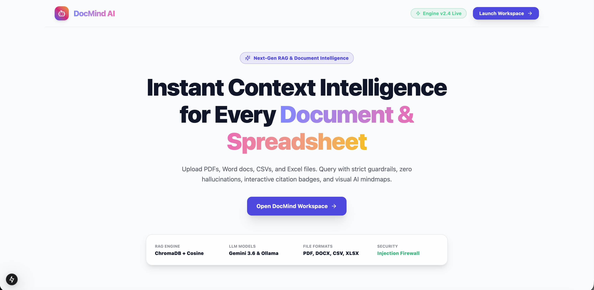
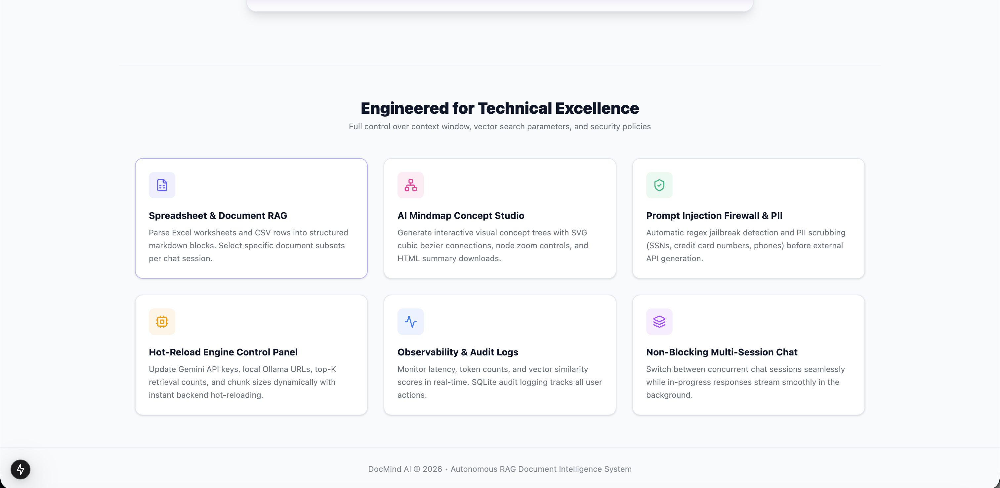
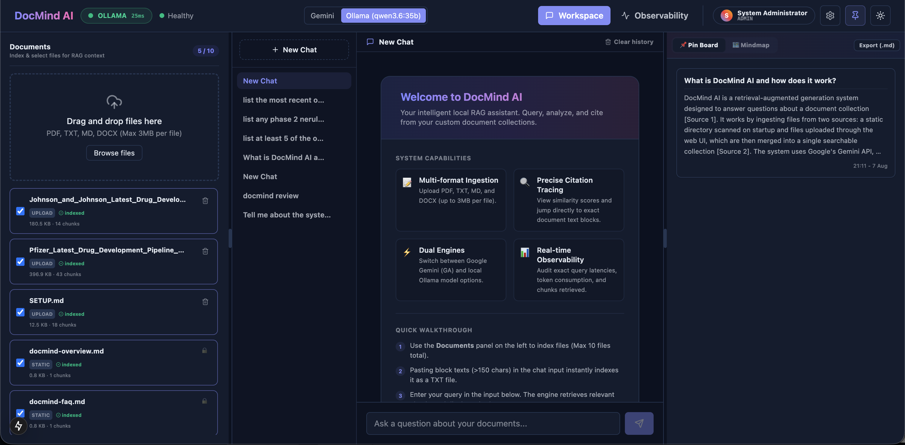
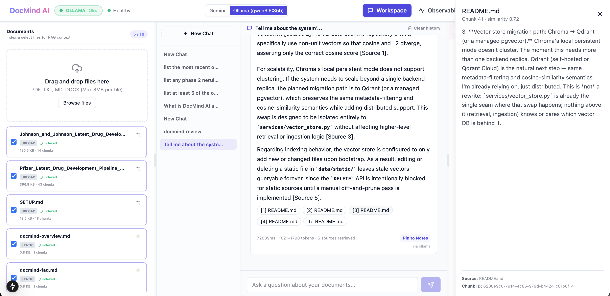
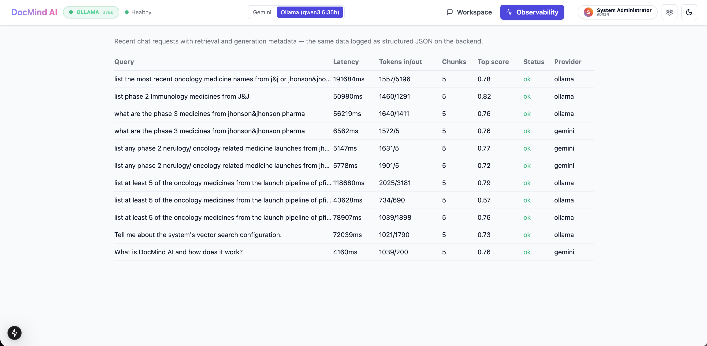
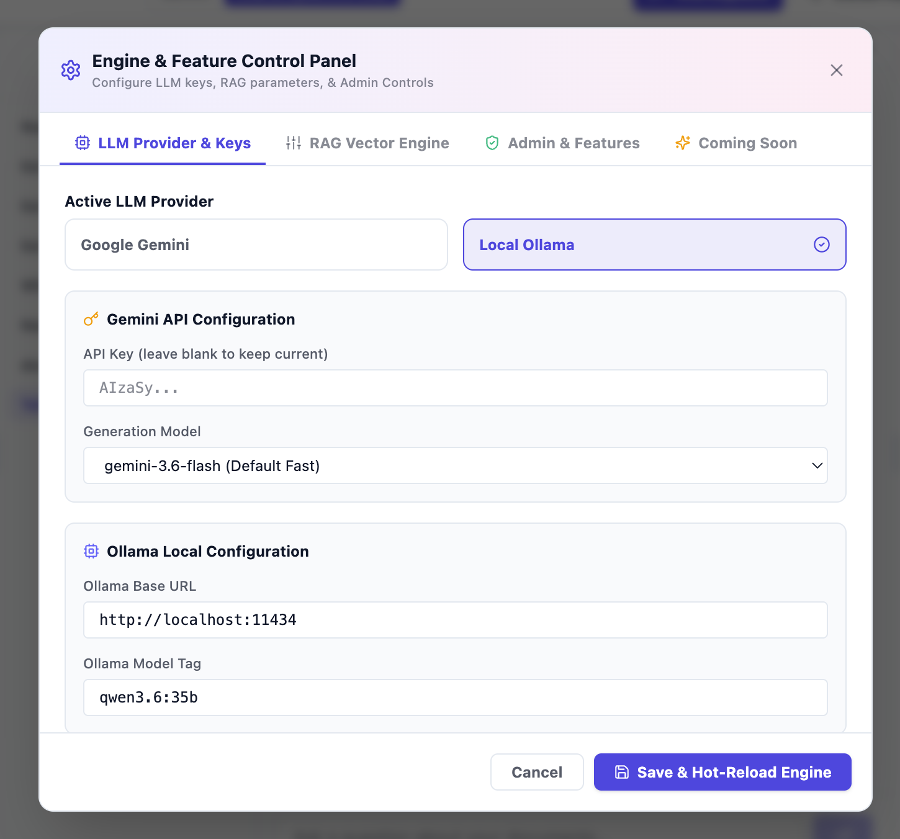
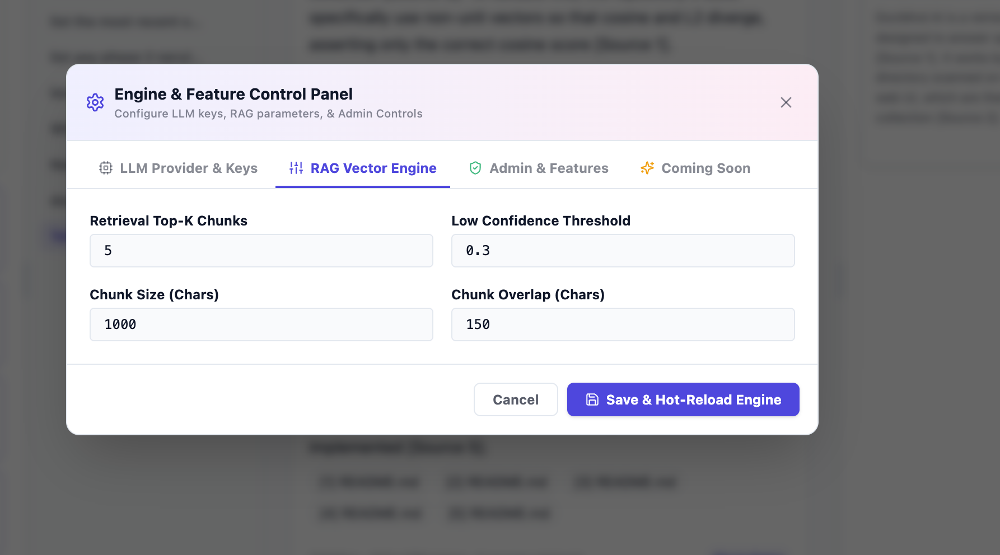
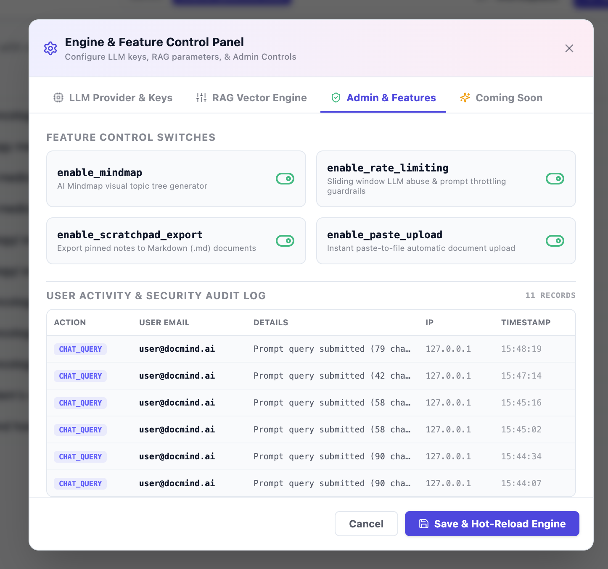

# DocMind AI

A RAG assistant that answers questions over a document collection, with citations back to the exact chunk an answer came from. Built for the "Chat With Your Docs" option of this take-home. Python/FastAPI backend, Next.js frontend, Gemini for embeddings and generation, ChromaDB and SQLite running locally alongside the app.

[](https://youtu.be/1JOeYYavYQA)

This document covers what I built, the reasoning behind the RAG-specific choices, what I left out on purpose, and — since a few things below don't hold up to full scrutiny — where the honest state of the code is weaker than the feature list makes it sound.

## Quick setup

```bash
git clone <this-repo>
cd docmind-ai
cp .env.example .env
# set GEMINI_API_KEY in .env — get one at https://aistudio.google.com/apikey
docker compose up --build
```

- Backend: `http://localhost:8000` (Swagger docs at `/docs`)
- Frontend: `http://localhost:3000`

On first boot the backend indexes whatever's in `backend/data/static/` (two seed docs about the app itself are included, so there's something to query right away). Drop more files there and restart, or upload through the Documents tab.

`SETUP.md` has the fuller version of this — a local no-Docker path, a `scripts/setup.sh` that picks Docker or local automatically and waits for real health checks instead of assuming a process starting means it's ready, and a troubleshooting table for the gotchas below.

Two things worth knowing before you run it:

- **Ollama and Docker networking.** If you want to run generation against a local Ollama instead of Gemini, `localhost` inside the backend container does not mean your host machine — it means the container. Compose already points `OLLAMA_BASE_URL` at `http://host.docker.internal:11434` for this reason, and Ollama needs to be started with `OLLAMA_HOST=0.0.0.0 ollama serve` so it accepts connections from the Docker bridge network at all. None of this is needed for the default Gemini-only path.
- **Upgrading an old checkout.** Schema changes are applied by dropping and recreating the local database rather than through a migration tool (more on that decision below). If you have a database from an earlier version of this repo, delete it — `rm backend/data/docmind.db` locally, or `docker compose down -v` for Docker.

## Architecture

```
                         Next.js 15 frontend
                    Chat (multi-session) / Documents
                       / Observability / Admin
                                  |
                         REST + SSE, typed client
                    generated from the backend's OpenAPI schema
                                  |
                           FastAPI backend
                 api/chat  api/documents  api/settings
                 api/observability  api/auth
                 core/rag: chunking, retrieval, prompt
                                  |
                  -------------------------------
                  |                              |
              SQLite                        ChromaDB
        documents, chat sessions        persistent, local file mode
          and messages, users
                                  |
                       Gemini API (embeddings, always)
                gemini-embedding-001, 768-dim, normalized
                                  |
                    Gemini (gemini-3.6-flash) or
                 a local Ollama instance for generation,
                 switchable at runtime via /api/settings
```

Everything runs as two containers. No external managed services — SQLite and Chroma are both embedded, file-based stores.

## What's actually in here

The feature list grew past the original RAG core over the course of building this, and not everything grew at the same standard. Rather than let the architecture diagram imply more rigor than exists everywhere, here's a plain account of what's real and what's closer to a UI mockup wearing real endpoints.

**Solid and tested:** the RAG pipeline end to end — parsing (PDF, DOCX, TXT, MD, CSV, XLSX), chunking, embedding, retrieval, prompt assembly, streamed generation, citations, multi-turn chat with session persistence, the Observability tab, provider switching between Gemini and Ollama. This is where the 92 backend tests live, and where I did a real live run against the actual Gemini API to confirm the pipeline works end to end, not just in unit isolation.

**Real but shallow:** the security layer added later — prompt-injection detection and PII redaction are six and three regex patterns respectively, not a model-based classifier, and PII redaction only runs on the user's message before it's stored, not on retrieved document text or on the model's output. Rate limiting is a real in-memory sliding window (10 requests/minute per IP) but it resets on restart and won't work if you ever run more than one backend process. None of this is dishonest about what it claims to be if you read the code, but it would be dishonest of me to call it a "guardrail system" without this paragraph next to it.

**Cosmetic:** the admin/auth layer is the one part of this I'd redo before showing it to anyone as more than a UI sketch. "Google Sign-In" doesn't talk to Google — it's a labeled simulation modal that lets you claim any email as a demo login, and a fresh browser session defaults to being signed in as the admin account before you click anything. The admin bearer token check compares against a hardcoded string literal (`DocMind#Admin2026!Secure`) that also happens to be the fallback token the frontend sends on every request by default — so the "protected" admin endpoints are open by construction, not by a bug that slipped through. The Admin tab being hidden from non-admin users is a client-side conditional render; the backend doesn't check role at all. I'm flagging this here instead of letting it surface as a surprise, because pretending otherwise would undercut the one thing this section is trying to establish: that I know the difference between something I built to spec and something I built to look finished.

Two features that are real, working, and just didn't exist when I first scoped this: multi-session chat (create, rename, delete, switch sessions, each backed by its own row in SQLite, with streaming that keeps running in the background if you switch away mid-answer), and per-session document filtering (checkbox selection in the Documents tab restricts retrieval to chosen documents via a Chroma metadata filter — genuinely applied at query time, not filtered client-side after the fact).

## RAG decisions

### Chunking — RecursiveCharacterTextSplitter, 1000 characters, 150 overlap

Chunking happens per page, not per document — each parsed page is split independently and every chunk keeps that page's number, so a chunk never straddles a page boundary and a citation badge showing "page 4" is actually page 4. I didn't reach for AST-based chunking; that's the right tool for a code-documentation assistant, not prose. A paragraph-then-sentence-then-word separator cascade is the boring, correct choice here.

### Embedding — gemini-embedding-001, 768 dimensions, normalized manually

The model I'd originally have used, `text-embedding-004`, was deprecated by the time I built this, so I checked current docs rather than trust what I already knew about the API surface. The replacement supports truncatable output (3072 down to 256 dimensions via Matryoshka representation), and 768 gets close to peak retrieval quality at a quarter of the storage and compute cost of the full size — the right tradeoff for a local Chroma instance with no reason to max out vector size. One thing that would have quietly broken retrieval if I'd missed it: this model doesn't auto-normalize truncated output, so the embedding service L2-normalizes every vector before it reaches Chroma. Skip that step and cosine similarity scores stop meaning anything.

### Generation — gemini-3.6-flash, streamed

Flash over Pro because this is a retrieval-grounded task: the model synthesizes an answer from context I've already retrieved and cites it, rather than reasoning from scratch. That's Flash's job, and Pro would just be slower for no accuracy gain I'd notice at this scale.

### Ollama as a second generation provider

Every other piece of configuration in this project is set once via `.env` and fixed for the life of the process. Provider selection is the one place I broke that pattern, because the tradeoff between Gemini and Ollama is real and situational rather than one obsoleting the other: Ollama runs fully on-machine, costs nothing per token, and never sends document content over the network — at the cost of being noticeably slower. In my own testing, a comparable answer took roughly 21 seconds on a local `qwen3.6:35b` versus 3 seconds on Gemini. That's a real cost, not a footnote, so the switch belongs at request time rather than baked into deployment. `PATCH /api/settings` live-probes the target provider before accepting a switch and rejects it with a 400 if it isn't reachable, so a successful switch means the provider was actually there.

Embeddings stay on Gemini regardless of which generation provider is active — every vector already in Chroma is a 768-dim Gemini vector, and cosine similarity between vectors from two different embedding models is meaningless. Switching that would mean re-embedding the whole store, not flipping a setting.

### Vector store — ChromaDB, persistent local mode, cosine distance

Zero-ops, embeds as a file inside the container. Worth calling out because it's an easy silent bug: Chroma's default distance metric is L2, not cosine, and if you create a collection without explicitly setting `hnsw:space` to cosine, everything downstream that assumes `similarity = 1 - distance` computes garbage without ever throwing an error. A test that only checks a vector against itself won't catch this, because L2 and cosine both give zero distance there — the test that actually catches it needs non-unit vectors where the two metrics diverge.

### Orchestration — mostly hand-rolled

`langchain-text-splitters` is the only piece of LangChain or LlamaIndex in the codebase, used for exactly the recursive character splitter. Retrieval, prompt assembly, and generation are direct calls to the `google-genai` SDK in small single-purpose modules. For one retrieval strategy over a local document set, a thin custom pipeline is more debuggable than adopting a framework's abstractions for logic this simple. I'd reach for LlamaIndex if this needed agentic multi-step retrieval or a swappable retriever — it doesn't, so I didn't build for that.

### Prompt and context management

Retrieved chunks are deduplicated by document and chunk index, then concatenated up to a 6000-character budget, with one exception: the first chunk is always included even if it alone exceeds the budget, so a single large relevant chunk never gets dropped entirely. Conversation memory is the last four messages, included verbatim, no summarization — summarization would let the model lose precise detail from early in a long conversation, and it adds an extra LLM call and a new failure mode for a use case that doesn't need it yet. If this needed to support long conversations, a sliding-window-plus-summary hybrid is the next step.

### Guardrails and quality control

I kept these as two separate mechanisms, because they fail differently and conflating them makes debugging harder. The guardrail is the system prompt instructing the model to answer only from provided sources and say plainly when it doesn't know. Quality control is a similarity-score threshold (0.3 by default), computed before the model ever sees the query — if the top retrieved chunk scores below it, the turn is flagged low-confidence and shown as a warning in the UI. A guardrail failure means the model ignored instructions; a low-confidence flag means retrieval didn't find anything relevant in the first place. Those need different fixes, so I didn't want one signal standing in for both.

Separately from that, there's the prompt-injection and PII-redaction pass described above — regex-based, applied to user input only. It catches the obvious cases ("ignore previous instructions," SSN-shaped strings) and nothing subtler. I'd call it a first pass, not a guardrail I'd stake anything on.

Gemini calls retry with exponential backoff on rate-limit and server errors, but only around starting the stream, not around iterating it — once tokens are reaching the client there's no clean way to resume a partially streamed response, so a mid-stream failure surfaces as an error frame instead of a silent retry. That's a real limitation I haven't fixed, not an oversight I'm unaware of.

### Observability

Structured JSON logs via the standard library's `logging` module plus a small custom formatter — I skipped `structlog` on purpose, since the output shape is the same either way and it's one fewer dependency to justify. Every chat turn records latency, token counts, chunks retrieved, and top similarity score directly on its database row, and the Observability tab in the frontend reads that same data back live. That was the highest-leverage UI decision in the project, because it turns "there's structured logging" from a README claim into something you can watch update while you use the app.

## Key technical decisions

| Decision | Why |
|---|---|
| Citations stored as denormalized JSON on the chat message row, not a separate table | Citations are only ever read alongside their parent message — a join buys nothing here |
| No migration framework | Schema changes are rare enough that dropping the local dev database when one happens is cheaper than carrying Alembic. This did happen once (a `provider` column got added) and the cost was exactly "delete one file" |
| Synchronous document ingestion, no task queue | Files are small and local for this use case; a queue is infrastructure weight with no payoff yet — first thing I'd add for large concurrent uploads |
| Provider selection lives in memory, not a database row | Resets to the configured default on restart. Persisting it would mean either a settings table or writing back to `.env` at runtime, both more machinery than a single-process local tool needs. A multi-replica deployment would need this in a real store, same day auth got added |

One bug worth mentioning on its own: the chat endpoint's first version fetched conversation history, committed the new user message, then tried to read that history again inside the streaming generator — which by then was running after the request's database session had already closed. It worked for the first message of any conversation and crashed on the second, because nothing in the initial test pass exercised two sequential messages in the same conversation. It surfaced during a review pass that specifically asked whether the endpoint handled an actual multi-turn conversation, which is the whole point of a chat feature. A green test suite tells you what got tested, not what got built — this was a good reminder of that.

## Engineering standards followed, and some I didn't

**Followed, and I'd stand behind these:**
- Test-first development for the original RAG core — chunking, parsers, embedding, vector store, ingestion, retrieval, prompt assembly, generation, and the initial API routes were written test-first, with the failing state actually run before the implementation existed.
- Structured logging and per-request metrics from the start, not bolted on later.
- Generated types across the stack boundary — the frontend's TypeScript types come from the backend's live OpenAPI schema (`scripts/generate-types.sh`), so a backend field rename breaks the frontend build instead of failing silently at runtime.
- Every mocked test boundary is the actual network edge (the Gemini API) — vector store and ingestion tests hit a real ephemeral Chroma instance and real SQLite, because mocking those would mean testing the mocks instead of the code.

**Skipped, and I want to be specific about the cost of each:**
- No CI pipeline. The suite runs and passes locally; wiring it into GitHub Actions is mechanical and I'd rather spend the time on things that needed judgment.
- No frontend tests at all. This is the gap I'd close first with more time — nothing here checks the streaming, upload, or session-switching state machines except by hand.
- Test-first discipline didn't hold for everything added after the initial RAG core. The 92 tests are almost entirely concentrated on the original pipeline; the auth router, rate limiting, CSV/XLSX parsing, and the whole frontend feature set added later (landing page, Mindmap Studio, sessions, document filtering) have little or no automated coverage. That's not a style choice — it's the later features outrunning the discipline the earlier ones were held to, and it's the honest reason the security layer above is weaker than it looks.
- No real auth, despite there being an auth router. I noted this plainly in the section above rather than let the endpoint names imply more than the implementation delivers.

## Productionizing this

In roughly the order I'd actually do it:

1. **Real auth, first.** Replace the hardcoded admin secret and simulated Google sign-in with actual OAuth and a token the backend verifies against a real identity provider, and enforce role checks server-side instead of only hiding UI. This is the one item on this list I'd do before anything else, including before adding new features, because right now the admin surface is open to anyone who reads the network tab.
2. **Async ingestion.** A large upload currently blocks the request until embedding finishes. Move it to a background worker (Celery/RQ + Redis, or a managed queue like SQS + Lambda or Cloud Tasks) and return immediately, letting the existing "processing" status in the Documents tab do its job.
3. **A real secrets store.** The runtime config-mutation endpoint currently rewrites `.env` on disk, including the Gemini API key. In a real deployment that's a secrets manager (AWS Secrets Manager, GCP Secret Manager) with the mutation endpoint gated behind the auth from step 1.
4. **Redis for hot-query caching.** Repeated questions against the same document set are likely — caching query embeddings and retrieval results for a short TTL cuts both Gemini calls and Chroma latency without touching correctness.
5. **Vector store migration path.** Chroma's local persistent mode doesn't cluster. The moment this needs more than one backend replica, Qdrant (self-hosted or managed) is the natural next step, using the same cosine-similarity semantics already in place — the vector store module is already the single seam where that swap happens.
6. **Deployment.** Cloud Run for both services if staying on GCP — scale-to-zero fits this traffic pattern and the existing Dockerfiles need no changes. ECS Fargate behind an ALB is the AWS equivalent, with more infrastructure to hand-configure for the same result.
7. **Postgres instead of SQLite**, once there's more than one backend replica — SQLite's single-writer model doesn't hold up to horizontal scaling.
8. **A rate limiter that isn't in-process memory** — Redis-backed or pushed to an API gateway, so it actually holds across restarts and multiple instances.
9. **A reranking stage** between retrieval and generation if precision ever becomes the bottleneck. I didn't build this because with a small document collection, cosine similarity alone is already precise enough that the added latency wouldn't be worth it yet — it's the standard next lever once that stops being true.

## What I deliberately didn't build

The brief states outright that a solid, well-engineered basic solution beats an over-engineered complex one, and I took that as a real constraint rather than a throwaway line:

- **Multi-tenant document workspaces.** One shared document collection covers everything the assignment actually asks for (static and uploaded documents merging into one searchable store) without the routing and CRUD surface a workspace switcher would add.
- **A normalized citations table, a migration framework, a background task queue.** All covered above — the right call at a scale this isn't at yet.

I'd rather submit a smaller system I can defend every line of than a larger one where part of the code exists because it looked thorough.

## How I used AI tools in this build

I used Claude Code throughout. The useful way to describe that isn't "I used an AI coding assistant" — it's where I drew the line between what I let it own and what I did myself.

What it was good for: mechanical implementation against a spec I'd already settled — writing a chunking function against a signature I'd already specified, SQLAlchemy models against a schema I'd already designed, React components against an interface I'd already decided. That's the right use of it: fast at typing correct code once the decisions are made, and not the one making the decisions.

What I did myself, every time: the actual design. Chunking strategy, model selection, retrieval approach, what to cut — settled before implementation started, not delegated and reviewed after the fact. I also had to catch it being confidently wrong about the API surface at one point: the model names I'd originally have used were stale by the time I built this (one was deprecated outright), and an AI assistant describing "the Gemini API" is describing its training data, not the live API. I checked both model names against current documentation before writing anything that depended on them.

Where I made it show its work rather than take its output on faith: every piece of this went through a review pass asking two separate questions — does this match what was actually asked, and is it actually correct, not just plausible-looking. That caught real bugs, not style nits: the `DetachedInstanceError` described above, which would have broken every second message of every real conversation; a file-deletion bug where removing one uploaded document could silently delete a different document's file if they happened to share a filename; and a Docker `COPY` instruction using shell syntax that instruction doesn't actually support. None of those were things I asked it to double-check specifically — they came from treating "the tests pass" and "this is correct" as genuinely different claims and checking the second one separately every time.

What I'd tell someone else doing this: verify anything with a shelf life — model names, API surfaces, library versions — against a live source rather than what the model remembers, because it sounds equally confident either way. Keep "does this match spec" and "is this good code" as two separate questions, because code can satisfy a spec while being subtly wrong in a way the spec never anticipated. Don't let it make the design decisions — it's genuinely useful for "here are three ways to do this, with tradeoffs" when you ask, but the choice has to be yours, because that reasoning is the actual thing anyone reviewing this is evaluating. And don't take a passing test suite as proof of correctness — the `DetachedInstanceError` bug passed its own tests and failed on the one scenario, a real multi-turn conversation, that the feature existed for.

Where I fell short of my own standard: the security and admin features described above are the clearest counterexample to everything in the paragraph above. They went in later, under less of the review discipline the original RAG core got, and it shows — a hardcoded secret, a decorative sign-in flow, near-zero test coverage. I noticed this doing a pass to write this document, not while building the features, which is itself the finding worth stating plainly: the review discipline has to apply to every feature added, not just the ones from the first pass, or it isn't really a discipline.

## What I'd do differently with more time

Roughly in the order I'd tackle them:

1. **Fix the auth layer for real** — replace the hardcoded secret and simulated sign-in with something that would survive being pointed at by a security reviewer, not just a feature demo.
2. **Frontend test coverage** — the streaming, upload, and session-switching state machines are the one place with zero automated coverage.
3. **Bring the later features up to the same test standard as the RAG core** — auth, rate limiting, and spreadsheet parsing all shipped with thin or no tests, which is a discipline gap, not a scope gap.
4. **Async ingestion** before it becomes a real bottleneck rather than after.
5. **Resumable streaming** — fix the gap where a mid-stream Gemini failure means starting the answer over rather than resuming it.
6. **A small eval set** — a fixed list of question/expected-citation pairs checked into the repo, so a future change to chunking or retrieval parameters has a regression signal beyond "it still returns something."
7. **Reranking**, once there's a large enough document set to actually measure whether it improves precision.

### Known limitations worth stating plainly

- **Citation badges show what was retrieved, not necessarily what was cited.** Every chunk handed to the model as context gets a badge, even if the model only grounded its answer in one of them. Deriving true citations would mean parsing the model's `[Source N]` markers back out of the finished answer, which I didn't build.
- **Static documents are add-only.** Editing or deleting a file in `data/static/` doesn't clean up its old indexed version — the bootstrap only adds new-or-changed files, so an edited file leaves a stale second copy queryable indefinitely, and a deleted file's vectors become unreachable through the API. A real deployment needs a diff-and-prune pass on boot.
- **The security and admin layer is demonstration-grade**, for all the reasons above — I'd rather this be the last thing you read here than a surprise later.

## Screenshots

**Landing page.** The app doesn't drop straight into the chat UI — it opens on a product-style landing page first, with a feature summary underneath the fold.




**Workspace, dark mode.** The welcome state inside a session, before any question is asked — system capabilities and a short walkthrough instead of a blank box.



**Chat with citations and the source drawer open.** This run has real uploaded documents indexed alongside the static seed files, several past sessions in the sidebar, and a citation drawer open on the right showing the exact retrieved chunk (`README.md`, chunk 41, similarity 0.72) behind one of the numbered source badges in the answer.



**Observability tab.** The same latency/token/chunk/similarity metrics that get written to the database on every turn, read back live — including which provider, Gemini or Ollama, answered each one. This run makes the latency gap between the two concrete: the Ollama rows run from roughly 44 to 192 seconds against real documents, the Gemini rows for comparable questions sit around 5-7 seconds.



**Engine & Feature Control Panel.** The runtime settings surface referenced throughout this document — provider switching and Gemini/Ollama configuration, then the retrieval and chunking parameters, both editable and hot-reloadable without a restart.




**Admin & Features tab.** Feature flags (mindmap, rate limiting, scratchpad export, paste-to-upload) next to a live security audit log of chat activity. This is the real, working half of the admin surface — the part worth trusting is here, not in the sign-in flow described earlier in this document.


